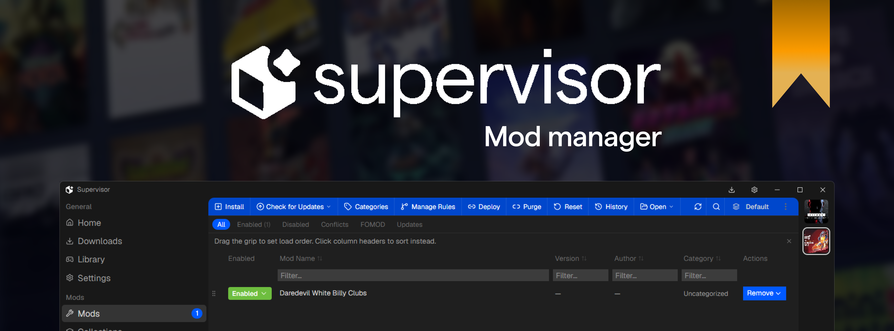
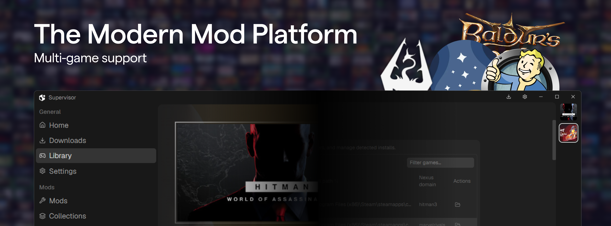
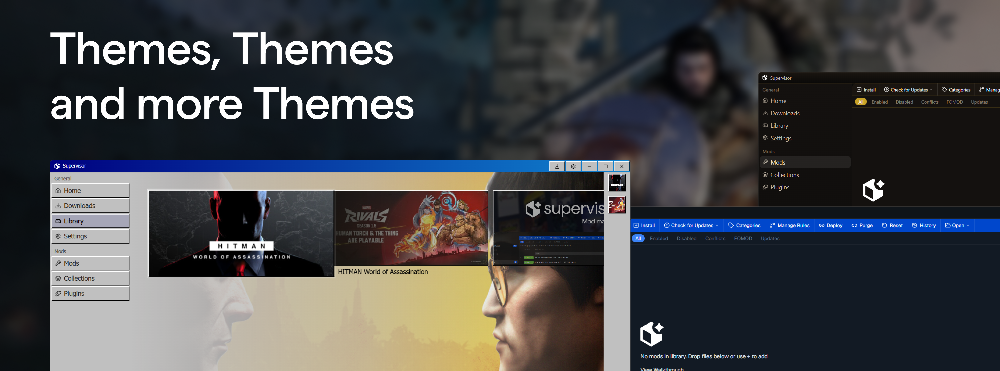

This app is in beta, expect issues!
Report them [here](https://github.com/natcale/Supervisor/issues).



[](https://github.com/natcale/Supervisor/releases)


## Introduction

Supervisor is a cross-game mod manager and launcher for **Windows**. It detects installed games from Steam, Epic, GOG, and Heroic, helps you install mods from archives or Nexus links, and deploys them into your game folder with hardlinks.

## Features

**Multi-game support**: Skyrim SE, Fallout 4, Starfield, Cyberpunk 2077, Elden Ring, Baldur's Gate 3, Valheim, and many more via game profiles.

**"Download With Vortex" Support**: Receive Nexus download links from your browser

**Hardlink deployment**: Space-efficient installs with drift detection

**Loadouts**: Per-game mod profiles you can switch between

**FOMOD installer**: Guided setup for mods that need install options

**Bethesda plugins**: Plugin list with LOOT auto-sort and `plugins.txt` persistence

**Collections**: Bulk archive import and Vortex `.collection` manifest parsing

**Downloads queue**: Track Nexus downloads in-app with API-backed download links; concurrent workers and speed limits

**Auto-updates**: Check for app updates from GitHub Releases (Tauri-signed, not Authenticode)

**Themes**: Install `.svtheme` packages to customize colors, fonts, and layout slots

## Getting Started




### Windows users (recommended)

Download the latest release from [Releases](https://github.com/natcale/Supervisor/releases).

**Portable builds:** Extract the ZIP anywhere and run `supervisor.exe`. Data still lives under your user app-data folder unless you override paths in Settings.

### From source

Requirements: [Bun](https://bun.sh), [Rust](https://rustup.rs), and [Tauri prerequisites for Windows](https://v2.tauri.app/start/prerequisites/).

```bash
bun install
bun run tauri:dev
```

Build a Windows installer locally:

```bash
bun run tauri:build
```

The NSIS installer is written to `src-tauri/target/release/bundle/nsis/`.

## Nexus API

Mod downloads from Nexus require a personal API key. In **Settings → Nexus Mods**,

Paste your key from [Nexus Mods API](https://www.nexusmods.com/users/myaccount?tab=api)

## Themes

Install community or custom themes from **Settings → Appearance → Install theme…**.

Themes use the `.svtheme` format

An **Example** reference theme for authors lives at `themes/packages/example/` See [docs/reference/themes/](docs/reference/themes/README.md).

You can find themes in our [Discord](https://discord.gg/ZGuu9TJzAe)

## Resources

- [Documentation](docs/README.md) — User guides, reference, and contributing docs
- [Nexus Mods](https://www.nexusmods.com/) — Mod downloads and API keys
- [LOOT](https://loot.github.io/) — Load order tool (optional, configurable in Settings)
- [Themes](docs/reference/themes/README.md) — `.svtheme` package format and layout slots

## Contributing

See [CONTRIBUTING.md](CONTRIBUTING.md). Bug reports and pull requests are welcome.

## License

This project is licensed under the [MIT License](LICENSE).

View on [Nexusmods](https://www.nexusmods.com/site/mods/1933)
