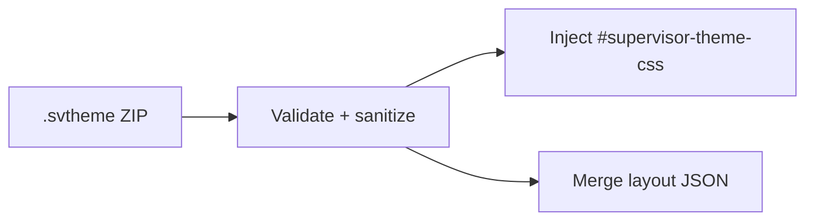

# Theme system

Supervisor themes are declarative packages — CSS plus optional layout hints — validated and injected at runtime.

## Pipeline

1. User installs `.svtheme` → extracted to app data
2. Rust validates manifest, sanitizes CSS, rejects dangerous file types
3. `ThemeProvider` injects CSS and registers `@font-face` for bundled fonts
4. Components read layout slots via `useThemeLayout().getSlot()`
5. **Default** theme clears injection; app uses built-in styles

## CSS-first design

Visual change should come from:

- `:root` variable overrides (global palette, typography, radii)
- `[data-theme-slot="…"]` rules (region-specific chrome)

Layout JSON adjusts a **small** set of structural fields (sidebar width, compact bar default, nav order). It is not a full UI builder.

This keeps themes safe (no JS), predictable (stable hooks), and powerful enough to reskin the entire shell.

## What themes can do

- Recolor and retypography the app
- Restyle titlebar, sidebars, popups, empty states, status bar
- Enable compact game bar by default
- Ship `.woff2` fonts

## What themes cannot do

- Inject JavaScript or load remote resources
- Add routes or replace React components
- Reposition arbitrary DOM without a registered slot

New slots require a maintainer PR adding `data-theme-slot` and documenting fields.

## Security model

CSS sanitization blocks `@import`, external URLs, and script-like patterns. Archive validation rejects executables and path traversal. See [Reference → Package format](../reference/themes/package-format.md).

## Authoring

Start from `themes/packages/example/` — commented CSS with no visual effect until uncommented.

## Related

- [Reference → Themes](../reference/themes/README.md)
- [Shell layout](../reference/themes/shell-layout.md)
